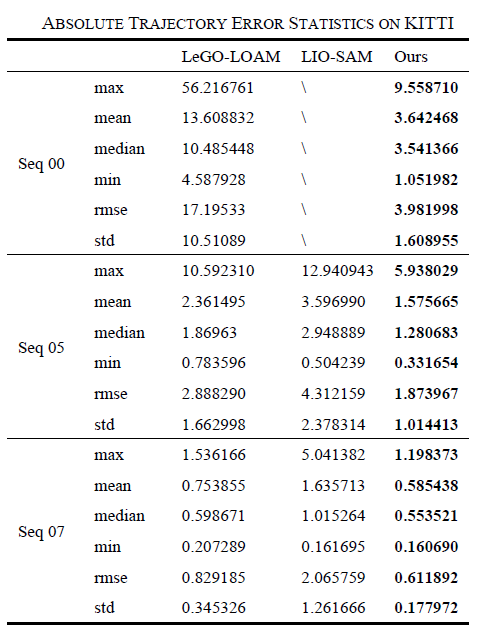
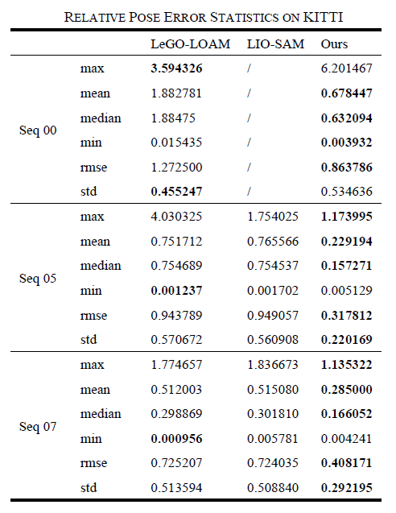
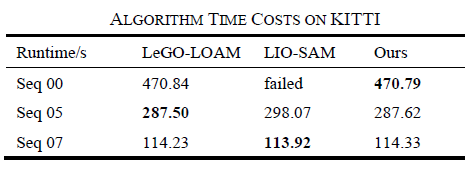
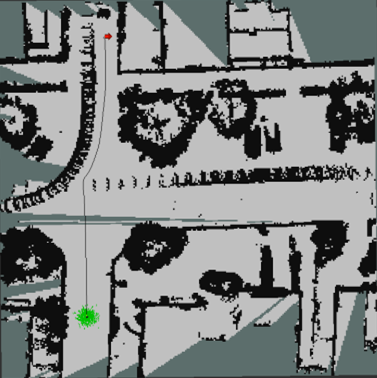
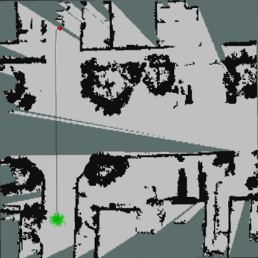

## 适用于动态环境下机器人导航的激光建图系统

**作者:** 周治国、冯新、邸顺帆、周学华

**发表时间:** xxxxxx

**期刊/会议:** IEEE Transactions on Intelligent Vehicles

**链接:** [文章链接]()

**代码仓库:** [代码仓库链接]()

**相关资源:** [其他资源链接，如数据集、演示视频等]()

### 概要

- 基于多线激光雷达的同步定位与建图(Simultaneous Localization and Mapping, SLAM)技术可以在未知环境中实现机器人的实时定位并构建环境地图。
- 然而，以这种方式构建的三维点云地图无法直接用于导航。同时，在复杂动态场景的建图过程中，动态物体的干扰会产生带有伪影的地图，这些伪影以障碍物的形式存在于地图中，对后续的导航造成不利影响。
- 为了解决这些问题，我们提出了一种适用于动态环境下机器人导航的激光雷达建图系统。
- 首先，提出了一种基于强度扫描上下文(ISC)闭环检测的激光雷达SLAM算法，构建原始三维点云图像，该算法可以有效抑制里程表位姿漂移，并在增加闭环检测模块的同时保证了算法的实时性。然后设计了一种获得适合机器人导航的二维栅格地图的方法，在滤除原始点云图中由动态物体轨迹引起的假性障碍物后，采用复合滤波器对点云地图进行进一步滤波，避免地面点云不均匀对导航造成的影响，再通过概率更新得到二维栅格地图。
- 实验结果表明，该建图系统适用于全局导航，在KITTI数据集上，所提出的算法的定位精度比LeGO-LOAM高46.5%，平均定位精度比LIO-SAM高59%，且运行时间最多增加了0.42%。

### 背景

-  在单次LiDAR SLAM或定位过程中，动态障碍物(如移动车辆、行人等)会对SLAM的两个方面产生负面影响:点云配准和地图构建。
-  在实际条件下，由于全局点云配准方法通常具有较强的鲁棒性，所以当使用全局点云进行配准时，绝大多数点云仍然可以找到它们对应的点，只有少数点受到干扰。另一方面，如果使用特征方法进行点云配准，在预处理阶段也会去除动态障碍物，因此基于特征的配准方法受动态障碍物的影响较小。
-  在地图构建方面，动态障碍物对点云地图的影响是在最终生成的地图中会出现伪影。如果只使用特征点云来构建地图，会错误地过滤掉许多实际物体信息，导致地图特征稀疏，难以进一步处理。
-  从自动驾驶的角度来看，从点云数据中去除动态障碍物是实现高精度地图构建的基本任务。滤波动态障碍物可以在一定程度上提高定位的精度和鲁棒性。
-  本研究的目的是提出一种动态环境下机器人导航的激光雷达建图系统，滤除虚假障碍物，获得不受运动物体影响的静态栅格地图，从而实现机器人全局导航。

### 关键贡献

- 我们提出了一个激光建图系统，与其他研究相比，我们的建图系统可以适用于复杂动态环境。该系统采用多线激光雷达传感器作为信息输入，通过我们提出的算法获得原始的3D点云地图，然后通过我们设计的一种获得二维栅格地图的方法，生成适用于动态环境下机器人导航的地图。
- 我们提出一种基于ISC回环检测的激光SLAM算法，该算法为建图系统提供原始点云地图。该算法的创新在于同时利用激光点云的几何信息和强度信息，采用强度扫描上下文（ISC）作为全局描述符进行回环检测以减少漂移误差、提升算法的定位精度；并以两步法分阶段对点云进行畸变补偿，以降低计算成本、保证算法的运行速度。
- 获得原始点云地图后，我们设计了一种在动态环境中获得适用于机器人导航的二维栅格地图的方法。我们对原始点云地图中动态物体轨迹造成的假性障碍物进行滤除，获得静态点云地图，然后通过一种以布料模拟滤波(CSF)为主体的复合滤波器对点云地图进行进一步处理，避免高低不平的地面点云对导航造成影响，最后以概率更新方式得到适用于导航的二维栅格地图。

### 实验结果

- 实验结果表明，本文提出的三维LiDAR SLAM建图系统中的基于强度扫描上下文回环检测的LiDAR SLAM算法对提高定位精度贡献最大。
- 与仅使用点云几何信息的SLAM算法相比，其在KITTI数据集上的定位精度比LeGO-LOAM算法高46.5%，比LIO-SAM算法平均定位精度高59%。
  
   
  
   
- 同时，与这两种SLAM算法相比，本系统中SLAM算法的运行时间最多增加0.42%，保证了运行效率。
  
  
- 此外，我们将本文的SLAM算法与Ford AV数据集上的LeGO-LOAM算法进行了比较。实验结果表明，该算法具有较高的定位精度，运行时间在0.05%以内，验证了贡献算法的有效性。  
  
- 最后，在ROS平台上，基于Gazebo仿真环境和TurtleBot3机器人模型，利用Navigation开源算法在网格地图上进行自主路径规划。实验结果表明，该系统可以在动态环境中生成不受运动物体影响的导航地图。  
    
  
  

### 引用

引用格式xxx
